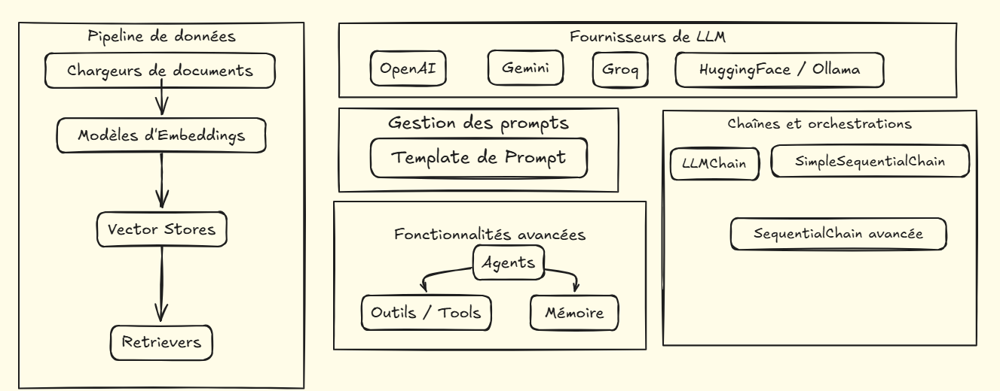

# Maitrisez Langchain (80%)
## Fonctionailtés principales de langchain 

### Ressources:

- Notebook: tuto_langchain.ipynb
- Fichier utilisé pour le tuto histoirep.txt
  
 [Groq](https://groq.com)

[Hugging Face](https://huggingface.com)

